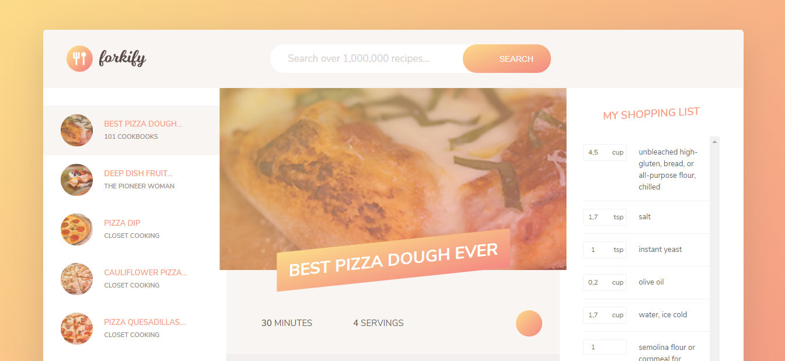

<!-- PROJECT LOGO -->
<br />
<p align="center">
  <a href="https://github.com/guimarbe/forkify-app">
    
  </a>
</p>

<!-- PROJECT NAME -->
# Forkify APP
Forkify is a web browser application for finding the most tasty food recipes. Its main goal is to learn the keys of modern JavaScript ES6.

<!-- TABLE OF CONTENTS -->
## Table of Contents
* [About the Project](#about-the-project)
	* [ES6](#es6)
	* [Module Pattern](#mvc-pattern)
	* [Project Structure](#project-structure)
	* [Compatibility](#compatibility)
* [Getting Started](#getting-started)
	* [Prerequisites](#prerequisites)
	* [Installing](#installing)
* [Usage](#usage)
* [Built With](#built-with)
* [Authors](#authors)
* [License](#license)
* [Contact](#contact)
* [Acknowlegments](#acknowledgements)


## About the Project


Forkify is a Web App developed by Jonas Schmedtmann in the Udemy course [The Complete JavaScript Course 2020](https://www.udemy.com/course/the-complete-javascript-course/). I wrote this code to learn the advanced techniques used to develop modern Web App's. Besides, this code will help to develop other Web App's as a code reference.

The focusing part of this project is the use of JavaScript **ES6**. All the project uses the next-gen JavaScript code used nowadays.

This project uses forkify API. You can check out its documentation [here](https://forkify-api.herokuapp.com/).

**Notes**
>The code is full of Spanish comments.


### ES6
JavaScript ES6 is a shortcut of ECMAScript 6, released in 2015. The most significal changes are:
* JavaScript let
* JavaScript const
* JavaScript Arrow Functions
* JavaScript Classes
* Default parameter values
* Array.find()
* Array.findIndex()
* Exponentiation
* And more!

### MVC Pattern
 MVC Pattern stands for Model-View-Controller Pattern. It's a design pattern that breaks an application into three parts:
 * **Model**: the data.
 * **View**: the presentation of that data to the user. Renders the model into a form suitable for interaction, typically a user interface element. In our case is a HTML page.
 * **Controller**: processes and responds to events launched by the actions taken in the user interface, and invokes changes on the model and/or view.

To develop a MVC Pattern in our JavaScript App, we should think first to build our app as a module pattern, so it's easier to divide the three important parts of this modern design pattern that is one of the most widespread and influential patterns in software architecture. To accomplish this goal we are going to use Webpack with the ES6 module syntax.

**Webpack**
Webpack is a bundler for modules. Its main goal is to bundle JavaScript files in a browser. It allows us to build a module encapsulation system similar like the IIFE with the closures statement used in the legacy JavaScript code. Webpack brings us the opportunity to create a fast, easy and scalable project structure where the scope of every single variable is not exposed. Besides, it's perfect to divide our code into a model-view-controller pattern, because each model or view can be coded in a single and independent JS file.

Webpack uses the ES6's syntax, *import* and *export* statements.

```js
// Exported script.js
export const recipe = {
	name: 'prosciutto e funghi italian pizza',
	ingredients: ['tomato', 'cheese', 'ham', 'mushroom'],
	servings: 4
}
```
It looks really simple, but it's tricky.

```js
// Imported script2.js
import { recipe } from './script.js';

console.log(recipe.ingredients);
```
Finally, the last thing is to write the **webpack.config.file** to bundle this two independent files into one:

```js
module.exports = {
    entry: ['babel-polyfill', './src/js/index.js'],
    output: {
        path: path.resolve(__dirname, 'dist'),
        filename: 'js/bundle.js'
    }
};
```

And that's it! We don't need nothing more. Just call the script file in the *index.html*. In this project, I used **webpack-cli**, **html-webpack-plugin** and **webpack-dev-server** for web development, so this makes possible to compile in real time.

**NOTE**
>Webpack is similar to CommonJS, a module formatting system. It is a standard for structuring and organizing JavaScript code.

### Project Structure
The project has been developed with this folder distribution:
* **dist**: *dist* folder stands for *distribution*, and is the **minified/concatenated** version, actually used on production sites.
	* **css**: contains the cascading styles of the app.
	* **img**: contains all the image files, icons and the favicon.
	* **js**: contains the bundle.js file.
* **src**: *src* folder stands for *source*, actually used on development process.
	* **js**: this file contains all js code, divided each MVC module pattern into a single file.
		* **models**: related to the model logic of MVC pattern.
			* *Likes.js*: it contains the raw data, methods and persistence function of Likes class.
			* *List.js*: it contains the add and delete methods of List Class.
			* *Recipe.js*: it contains the raw data of Recipe class and its methods.
			* *Search.js*: it contains an asynchronous query to the forkify API to find a recipe.
		* **views**: related to view logic of the MVC pattern.
			* *base.js*: it contains the query strings, loader icon and more.
			* *likesView.js*: it contains the render functions of the likes view.
			* *listView.js*: it contains the render functions of the list view.
			* *recipeView.js*: it is the main view, rendering all kind of recipes.
			* *searchViem.js*: it contains the render function of search view.
		* *index.js*: main file of JS code. It's related to the controller logic of MVC pattern.
	* *index.html*: our Web App. Just HTML code.
* *.babelrc*: babel config file.
* *webpack.config.js*: webpack config file.

In terms of development, is really important taking care of the folder hierarchy and how to order the elements. This kind of architecture is key when you are developing huge projects.

### Compatibility
JavaScript ES6 is full supported by the modern browsers, but there's a bunch of old browser that it is not. IE, Opera and older versions of the common web browser will not work properly. So, what can we do to solve this problem? Maybe you already know it, but if it's not, the best way is to use Babel.

**Babel** is a JS transcompiler to convert JS ES6 code into JS ES5 code. To use it, I've installed *babel-core*, *babel-loader*, *babel-preset-env* and, of course, *babel-polyfill*.

<!-- GETTING STARTED -->
## Getting Started
To setting up the project locally you can download a copy of this project clicking on the *Clone or download* and then *Download ZIP*, or you can follow these simple example steps to get a copy of Forkify on your repository.


### Prerequisites
First things first, you need to install npm to use all the tools provided in the project.
1. Open the Command Promt (on Windows) or Terminal (iOS) and type:
```
$ npm install npm@latest -g
```

### Installing
2. Clone the repository:
```
$ git clone https://github.com/guimarbe/forkify-app.git
```
3. Inside package.json there are all the dependendies used in this project. Install all NPM packages in the project folder:
```
$ npm install
```
4. You can open the **Development Process** typing:
```
$ npm start
```
5. Or you can simply build the *bundle.js* to run it in **production server**:
```
$ npm run build
```
5. That's it! Forkify is running succesfully :smile:


<!-- USAGE -->
## Usage
Feel free to use this code (see more on [license](#license)).
* Watch and interact with the different elements along the Web App.
* With your web browser, you can inspect all the elements to know how was built.
* You can used it to cook delicious food!

**NOTE**
>To find recipes, look at [this url](https://forkify-api.herokuapp.com/phrases.html) to know the search queries to type in the search bar.

## Built with
This project was built with:
* **Webpack**
* **Babel**
* **Axios**
* and more!

<!-- CONTRIBUTING -->
## Contributing
Contributions are what make the open source community such an amazing place to learn, inspire and create. Any contributions you make are **greatly appreciated**.

1. Fork the project.
2. Create your Feature Branch: `git checkout -b feature/example-name`.
3. Commit your changes: `git commit -m 'Add some features'`.
4. Push to the Branch: `git push origin feature/example-name`.
5. Open a Pull Request.

<!-- AUTHORS -->
## Authors
* **Guillem Martí**: built and documentation

<!-- LICENCE -->
## License
The license of this project is from [Jonas Schmedtmann](http://codingheroes.io). The code of this project is open source to learn but not for commercial purposes.

<!-- CONTACT -->
## Contact
Guillem Martí - [@guimarbe](https://twitter.com/guimarbe)

<!-- ACKNOWLEDGEMENTS -->
## Acknowledgements
* [atom](https://atom.io/)
* [Emmet](https://emmet.io/)
* [Webpack](https://webpack.js.org/)
* [Babel](https://babeljs.io/)
* [Axios](https://github.com/axios/axios)
* [Fractional](https://www.npmjs.com/package/fractional)
* [Uniqid](https://www.npmjs.com/package/uniqid)
* [Unsplash](https://unsplash.com/)
* [Ionicons](https://www.ionicons.com/)
